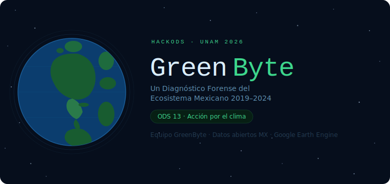

# Inicio {.unnumbered}

{width=100% fig-alt="Un Diagnóstico Forense del Ecosistema Mexicano 2019-2024"}

## Row {height="20%"}

### {width="50%"}
{fig-align="center"}

### {width="40%"} {height="20%"}

::: {.card .gb-hero-card}
::: {.gb-hero}

::: gb-eyebrow
MÓDULO DE INTELIGENCIA ECOSISTÉMICA V4.0
:::

::: gb-title
MÉXICO <span class="gb-accent">GREENBYTE</span>
:::

::: gb-sub
Un diagnóstico forense del territorio nacional. No partimos de una hipótesis, 
partimos de un interrogatorio estadístico a miles de datos satelitales 
para descubrir dónde y por qué se fractura la resiliencia climática de México.
:::

::: gb-pills
::: {.gb-pill .gb-p-green}
ODS 13: ACCIÓN CLIMÁTICA
:::
::: {.gb-pill .gb-p-blue}
DETECCIÓN AGNÓSTICA DE SESGOS
:::
::: {.gb-pill .gb-p-amber}
ANÁLISIS MULTIVARIADO
:::
:::

:::
:::


## {width="100%"}

### Nuestra Perspectiva: El Rigor de la Pregunta Abierta

**¿Por qué GreenByte?** La mayoría de los proyectos climáticos nacen con una respuesta y buscan datos que la validen. Sin embargo, cuando se trata de tomar conciencia y accion por el clima, no podemos partir de una idea o hipotesis prefabricada, si no que debemos dejar que sean los mismos datos los que nos cuenten el malestar climatico del pais.

**La Motivación:** Nosotros hemos decidimos que para realmete tomar accion por el clima, antes debemos conocerlo, o bien, entender que personajes actuan en la historia. Por ello, el proposito de **GreenByte** es hacer un primer escaner del clima Mexicano, integrar y contar lo que el suelo de este país clama, pero muchas veces se ignora.

 Interrogamos al territorio como una escena del crimen ambiental. Cruzamos variables atmosféricas (NO₂), biológicas (NDVI) e hidrológicas (Precipitación) para entender no solo *si* el país cambia, sino *de qué forma* está fallando la respuesta natural ante el estrés.

Este proyecto tiene naturalmete limitaciones, principalmente relacionadas a la baja cantidad de datos encontrados para este fin, y la estrecha ventana de tiempo que se analizo, sin embargo, el realto que nos cuentan estos datos es suficiente para discernir a grandes razgos como se comporta el clima de Mexico.


### {width="40%"}

::: {.callout-tip icon=false appearance="simple" .ods-13-card}

🟢 ODS 13: Acción por el Clima

El **ODS 13** forma parte de la Agenda 2030 de la ONU para adoptar medidas urgentes contra el cambio climático y sus impactos. 

Busca integrar medidas climáticas en políticas nacionales, mejorar la educación sobre el cambio climático y movilizar fondos para mitigar emisiones y aumentar la resiliencia ante desastres naturales.

Lo que el **ODS 13** busca es adoptar medidas urgentes contra el cambio climático y sus impactos. Nuestra misión en **GreenByte** es dar un primer paso para **integrar el rigor científico en políticas nacionales**, aumentar la resiliencia y mitigar emisiones mediante evidencia reproducible, no solo promedios.

Este objetivo es crucial para México debido a su alta vulnerabilidad a eventos climáticos, afectando sectores como la agricultura, la seguridad hídrica y la biodiversidad.
:::


# Diagnóstico Nacional {orientation="columns"}

## Column {width="60%"}

### La Paradoja de la Huella Humana

Para evitar sesgos, clasificamos el territorio en **Quintiles de Huella Humana (gHM)**. Queríamos saber: ¿Sufre más el bosque virgen o la ciudad industrial?

Lo que encontramos fue una **Divergencia Ecosistémica**:
- En las zonas prístinas (Q1), la naturaleza es honesta: pierde agua y pierde verdor.
- En las zonas industriales (Q5), hemos creado "burbujas" que mantienen un verdor artificial mientras la fiebre del suelo sube sin control.


## Column {width="40%"}

### {height="100%"}

::: {.card}
::: {.card-header}
**Matriz de Descubrimiento**
:::

Aquí es donde comenzó todo. Lanzamos una red de correlaciones sobre millones de datos satelitales. No buscábamos líneas rectas, buscábamos **anomalías**.

Al filtrar el ruido estadístico, la señal fue clara: México tiene 16 puntos donde el sistema simplemente se rompió. Estos son nuestros sospechosos principales.
:::

# Causalidad del Estrés

## Row {height=2%}

**Análisis de Impacto (n = 120,140)**

La correlación de Spearman confirma que las variables de presión antropogénica y climática están dictando la salud del ecosistema con una confianza estadística superior al **99.9%**.

## Row {height=3%}

**Hallazgos Clave:**

* **El Colapso Hídrico:** La relación inversa entre **LST_day** y **ET** (rho: -0.69) confirma que el aumento de temperatura inhibe la evapotranspiración.
* **Eutrofización Costera:** La correlación entre **NO2** y **Clorofila-a** (0.77) vincula la actividad industrial con la alteración marina.
* **Falso Verdor:** El vínculo entre la huella humana (**gHM**) y el **NDVI** (0.49) delata paisajes antropizados.

## 

**Visualización de Correlaciones**

{fig-align="center"}

## Row {height=5%}

**Análisis Crítico: El Nexo Tierra-Océano**

La correlación de **rho: 0.77** entre **NO2** y **Clorofila-a** es reveladora. El fitoplancton no consume NO2 directamente, pero este funciona como un **marcador de actividad industrial**.

**Ruta de Impacto:**

Las zonas con altas emisiones de NO2 coinciden con focos de **escorrentía de fertilizantes** y aguas residuales. Este nexo confirma que la presión humana altera la productividad primaria, precursora de la **hipoxia**.

**Veredicto:** 

El ecosistema opera bajo un régimen de estrés donde el calor es el verdugo de la disponibilidad de agua.

##

**Contribucion al ecosistema**

{fig-align="center"}

# Señal Climática Pura

## Row {height=60%}

### {width=40%}

**Aislamiento de la Señal ENSO (El Niño)**

Para un diagnóstico riguroso, hemos separado la variabilidad natural del fenómeno *El Niño/La Niña* de la tendencia oceánica real. 

**Resultados del Modelo Residual:**

* **Confianza Estadística:** Con un $p = 0.02$, hemos logrado detectar una señal climática que el "ruido" natural solía esconder.
* **Enfriamiento Subyacente:** Tras remover el efecto ONI, la superficie marina muestra un descenso de **-0.044°C/año**.
* **Desequilibrio Térmico:** Este hallazgo es crítico; mientras la atmósfera continental se calienta, el océano costero residual se enfría, creando un **"choque térmico"** que altera los regímenes de viento y transporte de humedad hacia México.

### {width=60%}

| Año | ONI (Fenómeno) | SST Real (°C) | Residual (Señal Pura) |
|---|---|---|---|
| 2015 | El Niño (Fuerte) | 26.19 | +0.35 |
| 2023 | El Niño (Extremo)| 25.67 | -0.22 |
| **Tendencia** | -- | -- | **Significativa (p=0.02)** |

> **Interpretación GreenByte:** El océano no está siguiendo el calentamiento de la tierra de forma lineal. Existe un proceso de enfriamiento residual que podría estar intensificando la sequía continental al reducir la evaporación efectiva hacia las costas mexicanas.


# Explorador Interactivo

##
Selecciona una variable y desliza el año para observar la evolución del estrés climático en México.

##

```{ojs}
//| echo: false
//| code-fold: false

// 1. CARGA DE PLOTLY — con require, que es nativo de OJS
Plotly = require("https://cdn.plot.ly/plotly-2.24.1.min.js").catch(() => window.Plotly)

// 2. CARGA DE DATOS
data = FileAttachment("resultados/master_greenbyte_v4.csv").csv({ typed: true })

// 3. CONTROLES
viewof selectedVar = Inputs.select(
  new Map([
    ["🌡️ Fiebre (Anomalía T2m)", "t2m_anomaly"],
    ["💧 Sed (Anomalía Precipitación)", "precip_anomaly"],
    ["🌿 Vigor Vegetal (NDVI)", "NDVI"],
    ["🏭 Contaminación (NO2)", "NO2"]
  ]),
  { label: "Variable:", value: "t2m_anomaly" }
)

viewof selectedYear = Inputs.range(
  [2015, 2024],
  { value: 2024, step: 1, label: "Año de Análisis:" }
)

// 4. FILTRADO
filtered = data.filter(d => +d.year === +selectedYear)

// 5. MAPA — todo en una sola celda, Plotly ya está resuelto arriba
{
  // Esperamos explícitamente a que Plotly esté listo
  const P = await Plotly;

  const div = document.createElement("div");
  div.style.cssText = `
    width: 100%; height: 700px;
    border-radius: 15px;
    background: #0f172a;
    border: 1px solid #1e293b;
    box-shadow: 0 4px 6px -1px rgb(0 0 0 / 0.1);
  `;
  yield div;

  if (!filtered || filtered.length === 0) return;

  const isAnomaly = selectedVar.includes("anomaly");

  const trace = {
    type: "scattergeo",
    lat: filtered.map(d => +d.latitude),
    lon: filtered.map(d => +d.longitude),
    mode: "markers",
    marker: {
      size: 4.5,
      color: filtered.map(d => +d[selectedVar]),
      colorscale: isAnomaly ? "RdBu" : "Viridis",
      reversescale: selectedVar === "t2m_anomaly",
      opacity: 0.9,
      colorbar: {
        title: { text: "Intensidad", font: { color: "#94a3b8", size: 12 } },
        tickfont: { color: "#94a3b8" },
        thickness: 18,
        len: 0.8
      }
    },
    hovertemplate: `<b>%{lat:.2f}N, %{lon:.2f}W</b><br>Valor: %{marker.color:.4f}<extra></extra>`
  };

  const layout = {
    geo: {
      scope: "north america",
      resolution: 50,
      showland: true,     landcolor: "#1e293b",
      showocean: true,    oceancolor: "#0f172a",
      showlakes: true,    lakecolor: "#0f172a",
      showcountries: true, countrycolor: "#475569",
      showcoastlines: true, coastlinecolor: "#475569",
      showframe: false,
      bgcolor: "rgba(0,0,0,0)",
      lonaxis: { range: [-118, -86] },
      lataxis: { range: [14, 33] },
      projection: { type: "mercator" }
    },
    margin: { r: 10, t: 40, b: 10, l: 10 },
    paper_bgcolor: "rgba(0,0,0,0)",
    plot_bgcolor:  "rgba(0,0,0,0)",
    font: { family: "Inter, sans-serif", color: "#f8fafc" },
    title: {
      text: `Análisis Geoespacial · ${selectedVar} · ${selectedYear}`,
      font: { color: "#22c55e", size: 16 },
      x: 0.05
    }
  };

  P.react(div, [trace], layout, { responsive: true, displayModeBar: false });
}
```


# Puntos Críticos {background-color="#f8f9fa"}

## 

**Diagnóstico de Supervivencia Ecosistémica ODS 13**

Utilizando la estadística espacial **Gi\* de Getis-Ord**, hemos identificado clústeres
donde el estrés no es un evento aislado, sino un fenómeno sistémico.

**Interpretación de la Simbología:**

- 🔴 **Hotspot (Rojo):** Zonas con valores altos de estrés rodeadas de otros valores
  altos ($p < 0.01$). Representan el epicentro del colapso.
- 🟠 **Estrés Aislado (Naranja):** Puntos individuales que superan el percentil 95
  de la muestra nacional.
- **Mapa de Calor:** Representa la densidad acumulada de presión antrópica y degradación.


## {height=20%}

### {width=40%}

```{ojs}
//| echo: false

{
  // ── 1. Cargar datos ──────────────────────────────────────────────
  const raw = await FileAttachment("resultados/master_greenbyte_v4_hotspots.csv").csv({ typed: true })

  // ── 2. Leaflet ───────────────────────────────────────────────────
  const L = await new Promise((resolve) => {
    if (window.L) return resolve(window.L)
    const link = document.createElement("link")
    link.rel = "stylesheet"
    link.href = "https://unpkg.com/leaflet@1.9.4/dist/leaflet.css"
    document.head.appendChild(link)
    const script = document.createElement("script")
    script.src = "https://unpkg.com/leaflet@1.9.4/dist/leaflet.js"
    script.onload = () => resolve(window.L)
    document.head.appendChild(script)
  })

  // ── 3. Contenedor ───────────────────────────────────────────────
  const div = document.createElement("div")
  div.style.cssText = "width:100%; height:600px; border-radius:12px; overflow:hidden;"
  yield div
  await new Promise(r => setTimeout(r, 50))

  // ── 4. Mapa base ─────────────────────────────────────────────────
  const map = L.map(div).setView([23.5, -102], 5)
  L.tileLayer("https://{s}.basemaps.cartocdn.com/dark_all/{z}/{x}/{y}{r}.png", {
    attribution: "© OpenStreetMap © CARTO",
    subdomains: "abcd",
    maxZoom: 19
  }).addTo(map)

  // ── 5. Helpers ───────────────────────────────────────────────────
  const esHotspot = d => {
    const v = d.hotspot_gi
    return v === true || v === 1 ||
           String(v).toLowerCase() === "true" || v === "1"
  }

  const vals = raw.map(d => +d.multi_stress).filter(v => isFinite(v)).sort((a, b) => a - b)
  const p95  = vals[Math.floor(vals.length * 0.95)]
  const df   = raw.filter(d => esHotspot(d) || +d.multi_stress > p95)

  // ── 6. DEBUG rápido (borra después) ─────────────────────────────
  console.log("Total filas:", raw.length)
  console.log("Filas en df:", df.length)
  console.log("Ejemplo fila 0:", raw[0])
  console.log("p95:", p95)

  // ── 7. Puntos ────────────────────────────────────────────────────
  let n = 0
  for (const row of df) {
    const lat = +row.latitude
    const lon = +row.longitude
    if (!isFinite(lat) || !isFinite(lon)) continue
    const hot = esHotspot(row)
    L.circleMarker([lat, lon], {
      radius:      hot ? 7 : 4,
      color:       hot ? "#ff6b6b" : "#e67e22",
      fillColor:   hot ? "#c0392b" : "#e67e22",
      fillOpacity: 0.85,
      weight:      hot ? 1.5 : 0.8
    })
    .bindPopup(`
        <b>${hot ? "⚠️ Hotspot Gi*" : "Estrés Aislado"}</b><br>
        Multi-stress: ${isFinite(+row.multi_stress) ? (+row.multi_stress).toFixed(2) : "N/A"}<br>
        Z-LST: ${isFinite(+row.z_LST) ? (+row.z_LST).toFixed(2) : "N/A"}<br>
        Z-NO2: ${isFinite(+row.z_NO2) ? (+row.z_NO2).toFixed(2) : "N/A"}
    `)
    .addTo(map)
    n++
  }

  // ── 8. Leyenda ───────────────────────────────────────────────────
  const legend = L.control({ position: "bottomleft" })
  legend.onAdd = () => {
    const d = L.DomUtil.create("div")
    d.style.cssText = `
      background: rgba(15,23,42,0.9); color: #f8fafc;
      padding: 10px 14px; border-radius: 8px;
      border: 1px solid #475569; font-size: 13px; line-height: 1.8;
    `
    d.innerHTML = `
      <b style="color:#22c55e">Simbología</b><br>
      <span style="color:#c0392b">●</span> Hotspot Gi* (clúster)<br>
      <span style="color:#e67e22">●</span> Estrés alto aislado<br>
      <small style="color:#94a3b8">${n} puntos · p95 = ${p95.toFixed(2)}</small>
    `
    return d
  }
  legend.addTo(map)

  setTimeout(() => map.invalidateSize(), 300)
}
```

### {width=40%}

#### 
{fig-align="center"}

#### 
{fig-align="center"}


## {height=30%}
{fig-align="center"}

## {height=30%}
{fig-align="center"}


# Hallazgos

## Row {height=70%}

### {width=70%}

{fig-align="center"}

### {width=30%}

**Diagnóstico: Inestabilidad Climática**

El análisis de series temporales revela que México enfrenta un **escenario de multi-estrés**. Aunque el periodo de 6 años es breve para tendencias climáticas definitivas, la pendiente de Sen permite identificar señales de alerta temprana.

**Alertas Críticas:**

* **Pulsos de Calor:** La anomalía de temperatura (`t2m`) muestra una pendiente positiva de **+0.097°C/año**, con un pico extremo en 2023 que dispara el estrés hídrico.
* **Vigor Vegetal en Declive:** Tanto el `NDVI` como el `EVI` presentan tendencias negativas, indicando una pérdida de salud fotosintética persistente en el territorio nacional.
* **Presión Atmosférica:** El `NO2` es la variable más cercana a la significancia estadística ($p=0.06$), confirmando un aumento sistemático en la carga contaminante.

**Conclusión:** La narrativa de los datos sugiere que el ecosistema mexicano está perdiendo su capacidad de amortiguar eventos extremos. La **"fiebre"** (calor) debilita la defensa, pero es la **"sed"** (déficit hídrico acumulado) lo que finalmente causa el colapso.

# Datos

## Row {height=65%}

### {width=65%}

{fig-align="center"}

### {width=35%}

**Auditoría de Calidad: Robustez y Alcance**

Este análisis se fundamenta en un flujo de datos de alta resolución, procesado rigurosamente para minimizar sesgos instrumentales y asegurar la reproducibilidad científica (v3).

**Fortalezas del Dataset:**
 
* **Continuidad Atmosférica:** El uso exclusivo de **Sentinel-5P** (TROPOMI) para NO2, SO2 y CO desde 2019 garantiza que las tendencias de contaminación no sean artefactos de un cambio de sensor.
* **Sincronía Temporal:** La integración del índice **ONI** al 100% permite correlacionar el estrés hídrico con ciclos globales de *El Niño/La Niña* con precisión total.
* **Control de Errores:** Se ha excluido el año 2024 de la variable `loss_anual` (detectado como NaN en auditoría) para evitar el sesgo de reporte incompleto del algoritmo de Hansen.

**Limitaciones y Sesgos:**

* **Eventos Discretos:** La menor cobertura en `fire_count` (24.2%) y `ET` (32.4%) responde a la naturaleza estocástica de los incendios y a la interferencia de nubosidad en sensores ópticos/térmicos. 
* **Restricción Geográfica:** Las variables oceánicas (**SST** y **Clorofila-a**) presentan coberturas del ~35-53% debido a que su dominio espacial se limita exclusivamente a las zonas costeras de México.

## Row {height=35%}

### {width=50%}

**Rango Geográfico de Análisis**

El estudio abarca una extensión latitudinal desde los **14.49°** hasta los **33.80°**, cubriendo desde la Selva Maya hasta el Desierto de Sonora. Esta cobertura total permite identificar el avance del estrés térmico en diversos biomas mexicanos.

### {width=50%}

**Ficha Técnica de Fuentes (v3)**

| Dimensión | Fuente Principal | Período |
|---|---|---|
| **Clima** | ERA5-Land (Anomalías T2m) | 2015–2024 |
| **Vegetación** | MODIS (NDVI / EVI) | 2015–2024 |
| **Calidad Aire** | Sentinel-5P (TROPOMI) | 2019–2024 |
| **Antrópica** | Global Human Modification (gHM) | 2019 (Ref) |