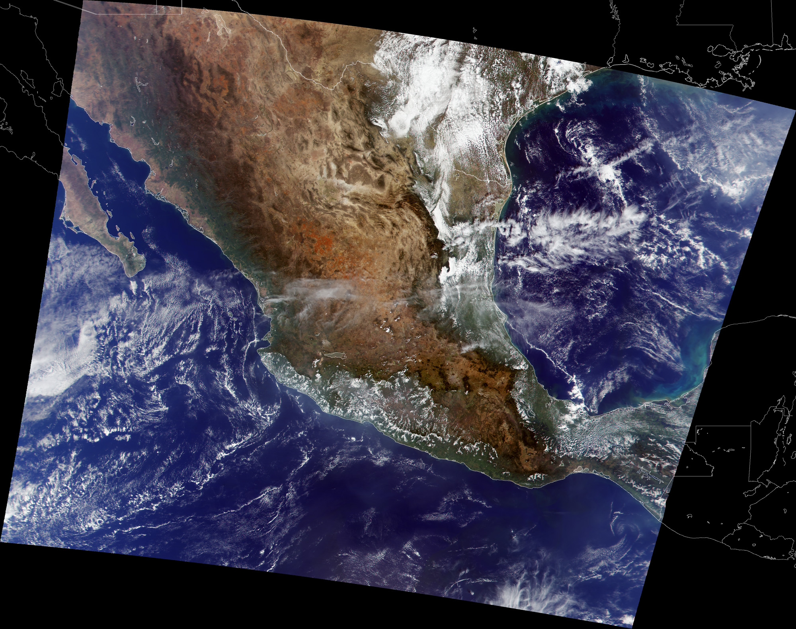
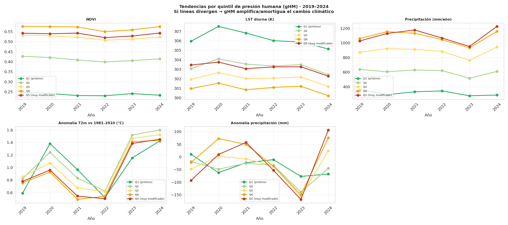
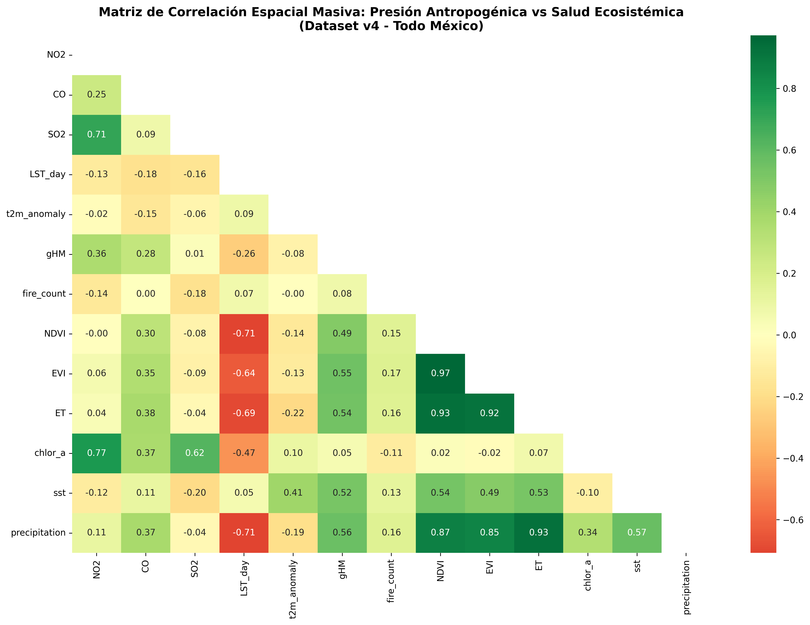
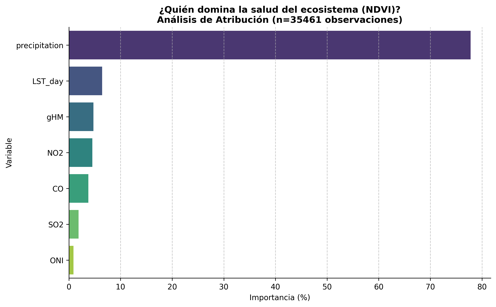
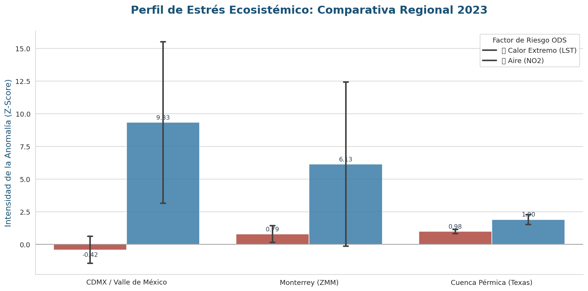
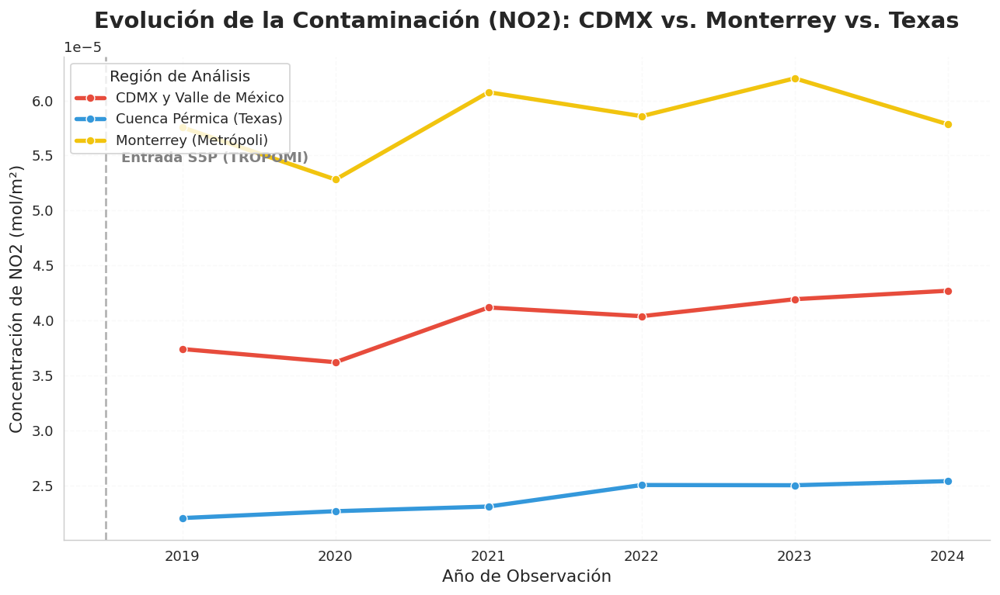
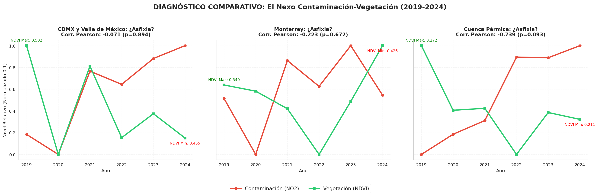
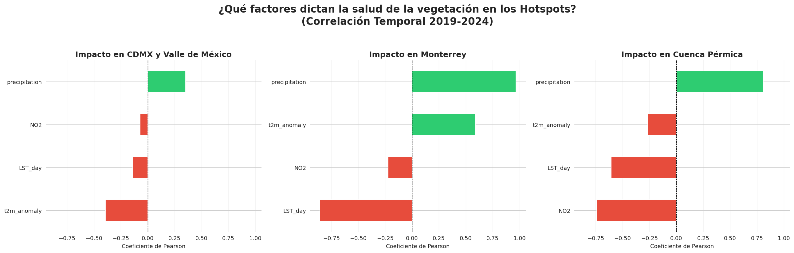
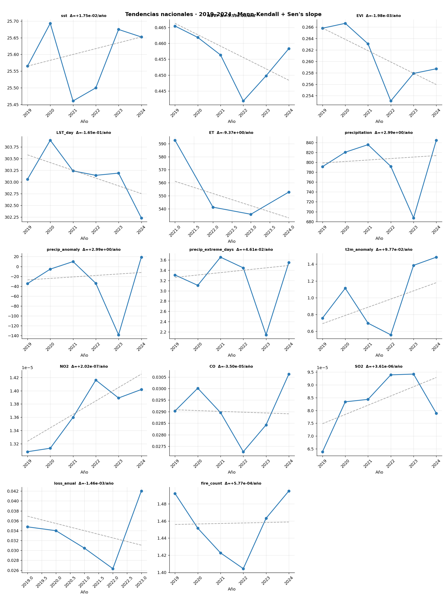
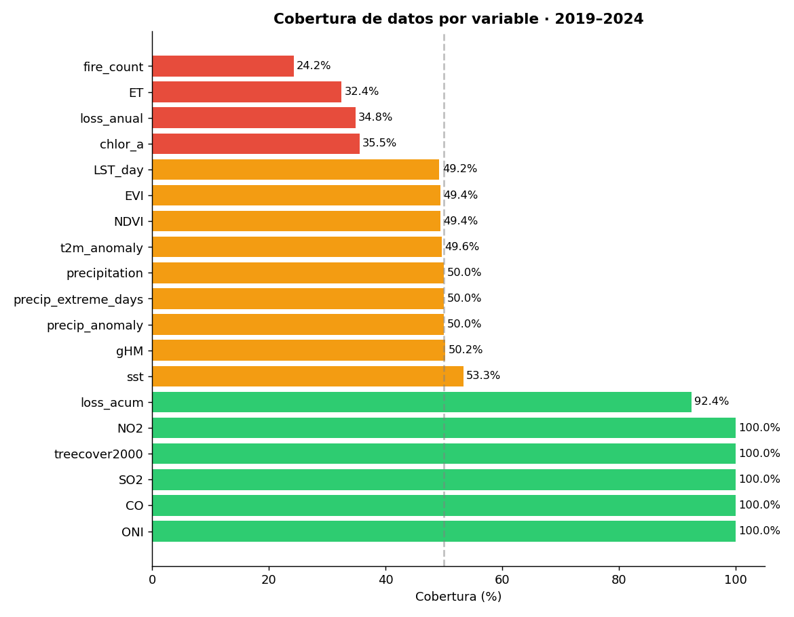

# Inicio {orientation="rows"}

<object data="hero.svg" type="image/svg+xml" width="100%" aria-label="Un Diagnóstico Forense del Ecosistema Mexicano" style="display: block; margin: -10px 0 15px 0;"></object>

## Row

### Diagnóstico Forense Satelital {width="50%"}

```{=html}
<div style="padding:0 5%; display:flex; flex-direction:column; justify-content:center; height:100%; gap:1.25rem;">

  <p style="font-size:1.05rem; line-height:1.7; margin:0;">
    Un interrogatorio estadístico a <strong>millones de datos satelitales retrospectivos</strong>
    para descubrir exactamente <strong>dónde, cómo y por qué</strong> se fractura la resiliencia
    climática de México, sin hipótesis previas.
  </p>

  <div style="display:grid; grid-template-columns:1fr 1fr; gap:0.75rem; align-items:stretch;">
    <div style="background:#f0f9f4; border-left:4px solid #27AE60; border-radius:6px; padding:1rem 1rem 1.8rem; text-align:center; display:flex; flex-direction:column; align-items:center; justify-content:center; gap:6px;">
      <div style="font-size:2.6rem; font-weight:700; color:#1a6b3c; line-height:1;">23</div>
      <div style="font-size:0.9rem; color:#555; text-transform:uppercase; letter-spacing:0.5px;">Variables satelitales</div>
    </div>
    <div style="background:#f0f6ff; border-left:4px solid #2980B9; border-radius:6px; padding:1rem 1rem 1.8rem; text-align:center; display:flex; flex-direction:column; align-items:center; justify-content:center; gap:6px;">
      <div style="font-size:2.6rem; font-weight:700; color:#1a5276; line-height:1;">10</div>
      <div style="font-size:0.9rem; color:#555; text-transform:uppercase; letter-spacing:0.5px;">Años de cobertura</div>
    </div>
    <div style="background:#fef9f0; border-left:4px solid #E67E22; border-radius:6px; padding:1rem 1rem 1.8rem; text-align:center; display:flex; flex-direction:column; align-items:center; justify-content:center; gap:6px;">
      <div style="font-size:2.6rem; font-weight:700; color:#9C5A00; line-height:1;">16</div>
      <div style="font-size:0.9rem; color:#555; text-transform:uppercase; letter-spacing:0.5px;">Hotspots críticos Gi*</div>
    </div>
    <div style="background:#fff0f0; border-left:4px solid #E74C3C; border-radius:6px; padding:1rem 1rem 1.8rem; text-align:center; display:flex; flex-direction:column; align-items:center; justify-content:center; gap:6px;">
      <div style="font-size:2.6rem; font-weight:700; color:#922B21; line-height:1;">120K</div>
      <div style="font-size:0.9rem; color:#555; text-transform:uppercase; letter-spacing:0.5px;">Observaciones procesadas</div>
    </div>
  </div>

  <div style="display:flex; gap:8px; flex-wrap:wrap;">
    <span style="background:#e8f5e9;color:#2e7d32;padding:5px 12px;border-radius:20px;font-weight:600;font-size:0.82em;border:1px solid #c8e6c9;">🌍 ODS 13: Acción Climática</span>
    <span style="background:#e3f2fd;color:#1565c0;padding:5px 12px;border-radius:20px;font-weight:600;font-size:0.82em;border:1px solid #bbdefb;">📡 Detección Agnóstica</span>
    <span style="background:#fff3e0;color:#ef6c00;padding:5px 12px;border-radius:20px;font-weight:600;font-size:0.82em;border:1px solid #ffe0b2;">📊 Análisis Multivariado</span>
  </div>

</div>
```

### {width="50%"}
::: {style="padding:0 5%;"}
{fig-alt="Imagen satelital MODIS de México" width="100%"}
:::
## Row

### {width="100%"}

```{=html}
<div style="width:85%; margin:0 auto; padding:0.5rem 0; display:flex; flex-direction:column; gap:2rem;">

  <!-- Cita hero -->
  <div style="text-align:center; padding:1.5rem 2rem; background:linear-gradient(135deg,#f6fdf8 0%,#e8f5e9 100%); border-radius:12px; border:1px solid #c8e6c9;">
    <p style="font-size:1.35rem; font-style:italic; color:#1a6b3c; line-height:1.6; margin:0;">
      "Interrogamos al país como si fuese una escena de crimen medioambiental."
    </p>
  </div>

  <!-- ¿Por qué GreenByte? -->
  <div>
    <h3 style="margin:0 0 0.75rem; color:#1a5276; font-size:1.05rem; text-transform:uppercase; letter-spacing:0.8px;">🔍 ¿Por qué GreenByte?</h3>
    <p style="margin:0 0 0.75rem; line-height:1.8; color:#333;">
      Hemos decidido que para tomar acción por el clima, primero debemos diagnosticar al ecosistema a nivel granular. El propósito de <strong>GreenByte</strong> es realizar un riguroso "pase de visita médico" ambiental; integrar científicamente lo que el territorio y el océano mexicano sufren cada hora, un diagnóstico que suele maquillarse cuando miramos simplemente los promedios nacionales.
    </p>
    <p style="margin:0 0 1rem; line-height:1.8; color:#333;">
      Nos rehusamos a validar hipótesis prefabricadas. Cruzamos indicadores instrumentales sobre factores de contaminación (NO₂), asfixia foliar (NDVI) y estrés térmico-hídrico (LST y ERA5) para comprender sin sesgos <strong>dónde y a qué velocidad</strong> colapsa nuestra geografía física ante la presión antrópica.
    </p>
    <div style="display:flex; gap:8px; flex-wrap:wrap;">
      <span style="background:#eaf5ea; color:#1a6b3c; padding:4px 12px; border-radius:4px; font-size:0.82em; font-weight:600; border:1px solid #c8e6c9;">NO₂ Contaminación</span>
      <span style="background:#eaf5ea; color:#1a6b3c; padding:4px 12px; border-radius:4px; font-size:0.82em; font-weight:600; border:1px solid #c8e6c9;">NDVI Asfixia Foliar</span>
      <span style="background:#eaf5ea; color:#1a6b3c; padding:4px 12px; border-radius:4px; font-size:0.82em; font-weight:600; border:1px solid #c8e6c9;">LST Estrés Térmico</span>
      <span style="background:#eaf5ea; color:#1a6b3c; padding:4px 12px; border-radius:4px; font-size:0.82em; font-weight:600; border:1px solid #c8e6c9;">ERA5 Anomalía Climática</span>
    </div>
  </div>

  <!-- Nota metodológica -->
  <p style="margin:0; font-size:0.82em; color:#999; font-style:italic; line-height:1.6; border-top:1px solid #eee; padding-top:1rem;">
    Nota Metodológica: Pese a requerir homologar los satélites a una ventana temporal corta (2019-2024), la significancia de los resultados permite mapear claramente los focos de peligro ecosistémico para la toma de decisiones presupuestales de resiliencia.
  </p>

  <!-- Divider ODS -->
  <div style="border-top:2px solid #e0e0e0; position:relative; text-align:center; margin:0.5rem 0;">
    <span style="background:#fff; padding:0 1rem; color:#888; font-size:0.82rem; text-transform:uppercase; letter-spacing:1px; position:relative; top:-0.7rem;">ODS 13 · Naciones Unidas · Agenda 2030</span>
  </div>

  <!-- ODS 13 box -->
  <div style="background:linear-gradient(135deg,#e8f5e9 0%,#f1f8e9 100%); border:1px solid #a5d6a7; border-radius:10px; padding:1.5rem 2rem;">
    <p style="margin:0 0 0.75rem; line-height:1.8; color:#1b5e20; font-size:0.98rem;">
      El <strong>Objetivo de Desarrollo Sostenible 13</strong> exige tomar medidas urgentes y transversales contra el cambio climático y todos sus devastadores impactos, exigiendo la adopción inmediata en la planeación nacional del país.
    </p>
    <p style="margin:0; line-height:1.8; color:#1b5e20; font-size:0.98rem;">
      Nuestra meta con <strong>GreenByte</strong> es entregar herramientas tecnológicas que sustenten <strong>la inyección del rigor geoespacial en la política pública</strong>, maximizando la eficiencia de fondos y programas de adaptación exactamente donde la ciencia detecta los focos de mayor sufrimiento.
    </p>
  </div>

  <!-- Alerta urgencia -->
  <div style="background:#fff8e1; border-left:4px solid #F39C12; border-radius:0 8px 8px 0; padding:1rem 1.5rem;">
    <p style="margin:0; font-size:0.95rem; color:#7d4e00; line-height:1.7;">
      ⚠️ <strong>Urgencia para México:</strong> Entre cinturones de aridez extendiéndose y costas térmicamente alteradas, nuestra seguridad alimentaria, hídrica y de biodiversidad cuelgan de un hilo si no priorizamos recursos a las zonas heridas con evidencia científica.
    </p>
  </div>

</div>
```


# Diagnóstico {orientation="columns"}

## Column {width="60%"}

### La Paradoja de la Huella Humana

Para evitar sesgos, clasificamos el territorio en **Quintiles de Huella Humana (gHM)**. Queríamos saber: ¿Sufre más el bosque virgen o la ciudad industrial?

Lo que encontramos fue una **Divergencia Ecosistémica**:
- En las zonas prístinas (Q1), la naturaleza es honesta: pierde agua y pierde verdor.
- En las zonas industriales (Q5), hemos creado "burbujas" que mantienen un verdor artificial mientras la fiebre del suelo sube sin control.



## Column {width="40%"}

### {height="100%"}

::: {.card}
::: {.card-header}
**Matriz de Descubrimiento**
:::

Aquí es donde comenzó todo. Lanzamos una red de correlaciones sobre millones de datos satelitales. No buscábamos líneas rectas, buscábamos **anomalías**.

Al filtrar el ruido estadístico, la señal fue clara: México tiene 16 puntos donde el sistema simplemente se rompió. Estos son nuestros sospechosos principales.
:::

# Causalidad

## Row {height=2%}

**Análisis de Impacto (n = 120,140)**

La correlación de Spearman confirma que las variables de presión antropogénica y climática están dictando la salud del ecosistema con una confianza estadística superior al **99.9%**.

## Row {height=3%}

**Hallazgos Clave:**

* **El Colapso Hídrico:** La relación inversa entre **LST_day** y **ET** (rho: -0.69) confirma que el aumento de temperatura inhibe la evapotranspiración.
* **Eutrofización Costera:** La correlación entre **NO2** y **Clorofila-a** (0.77) vincula la actividad industrial con la alteración marina.
* **Falso Verdor:** El vínculo entre la huella humana (**gHM**) y el **NDVI** (0.49) delata paisajes antropizados.

## 

**Visualización de Correlaciones**

{fig-align="center" width="70%"}

## Row {height=5%}

**Análisis Crítico: El Nexo Tierra-Océano**

La correlación de **rho: 0.77** entre **NO2** y **Clorofila-a** es reveladora. El fitoplancton no consume NO2 directamente, pero este funciona como un **marcador de actividad industrial**.

**Ruta de Impacto:**

Las zonas con altas emisiones de NO2 coinciden con focos de **escorrentía de fertilizantes** y aguas residuales. Este nexo confirma que la presión humana altera la productividad primaria, precursora de la **hipoxia**.

**Veredicto:** 

El ecosistema opera bajo un régimen de estrés donde el calor es el verdugo de la disponibilidad de agua.

##

**Contribucion al ecosistema**

{fig-align="center" width="70%"}

# Señal Climática

## Row {height=60%}

### {width=40%}

**Aislamiento de la Señal ENSO (El Niño)**

Para un diagnóstico riguroso, hemos separado la variabilidad natural del fenómeno *El Niño/La Niña* de la tendencia oceánica real. 

**Resultados del Modelo Residual:**

* **Confianza Estadística:** Con un $p = 0.02$, hemos logrado detectar una señal climática que el "ruido" natural solía esconder.
* **Enfriamiento Subyacente:** Tras remover el efecto ONI, la superficie marina muestra un descenso de **-0.044°C/año**.
* **Desequilibrio Térmico:** Este hallazgo es crítico; mientras la atmósfera continental se calienta, el océano costero residual se enfría, creando un **"choque térmico"** que altera los regímenes de viento y transporte de humedad hacia México.

### {width=60%}

| Año | ONI (Fenómeno) | SST Real (°C) | Residual (Señal Pura) |
|---|---|---|---|
| 2015 | El Niño (Fuerte) | 26.19 | +0.35 |
| 2023 | El Niño (Extremo)| 25.67 | -0.22 |
| **Tendencia** | -- | -- | **Significativa (p=0.02)** |

> **Interpretación GreenByte:** El océano no está siguiendo el calentamiento de la tierra de forma lineal. Existe un proceso de enfriamiento residual que podría estar intensificando la sequía continental al reducir la evaporación efectiva hacia las costas mexicanas.


# Explorador

##
Selecciona una variable y desliza el año para observar la evolución del estrés climático en México.

##

```{ojs}
//| echo: false
//| code-fold: false

// 1. CARGA DE PLOTLY — con require, que es nativo de OJS
Plotly = require("https://cdn.plot.ly/plotly-2.24.1.min.js").catch(() => window.Plotly)

// 2. CARGA DE DATOS
data = FileAttachment("resultados/master_greenbyte_v4.csv").csv({ typed: true })

// 3. CONTROLES
viewof selectedVar = Inputs.select(
  new Map([
    ["🌡️ Fiebre (Anomalía T2m)", "t2m_anomaly"],
    ["💧 Sed (Anomalía Precipitación)", "precip_anomaly"],
    ["🌿 Vigor Vegetal (NDVI)", "NDVI"],
    ["🏭 Contaminación (NO2)", "NO2"]
  ]),
  { label: "Variable:", value: "t2m_anomaly" }
)

viewof selectedYear = Inputs.range(
  [2015, 2024],
  { value: 2024, step: 1, label: "Año de Análisis:" }
)

// 4. FILTRADO
filtered = data.filter(d => +d.year === +selectedYear)

// 5. MAPA — todo en una sola celda, Plotly ya está resuelto arriba
{
  // Esperamos explícitamente a que Plotly esté listo
  const P = await Plotly;

  const div = document.createElement("div");
  div.style.cssText = `
    width: 100%; height: 700px;
    border-radius: 15px;
    background: #0f172a;
    border: 1px solid #1e293b;
    box-shadow: 0 4px 6px -1px rgb(0 0 0 / 0.1);
  `;
  yield div;

  if (!filtered || filtered.length === 0) return;

  const isAnomaly = selectedVar.includes("anomaly");

  const trace = {
    type: "scattergeo",
    lat: filtered.map(d => +d.latitude),
    lon: filtered.map(d => +d.longitude),
    mode: "markers",
    marker: {
      size: 4.5,
      color: filtered.map(d => +d[selectedVar]),
      colorscale: isAnomaly ? "RdBu" : "Viridis",
      reversescale: selectedVar === "t2m_anomaly",
      opacity: 0.9,
      colorbar: {
        title: { text: "Intensidad", font: { color: "#94a3b8", size: 12 } },
        tickfont: { color: "#94a3b8" },
        thickness: 18,
        len: 0.8
      }
    },
    hovertemplate: `<b>%{lat:.2f}N, %{lon:.2f}W</b><br>Valor: %{marker.color:.4f}<extra></extra>`
  };

  const layout = {
    geo: {
      scope: "north america",
      resolution: 50,
      showland: true,     landcolor: "#1e293b",
      showocean: true,    oceancolor: "#0f172a",
      showlakes: true,    lakecolor: "#0f172a",
      showcountries: true, countrycolor: "#475569",
      showcoastlines: true, coastlinecolor: "#475569",
      showframe: false,
      bgcolor: "rgba(0,0,0,0)",
      lonaxis: { range: [-118, -86] },
      lataxis: { range: [14, 33] },
      projection: { type: "mercator" }
    },
    margin: { r: 10, t: 40, b: 10, l: 10 },
    paper_bgcolor: "rgba(0,0,0,0)",
    plot_bgcolor:  "rgba(0,0,0,0)",
    font: { family: "Inter, sans-serif", color: "#f8fafc" },
    title: {
      text: `Análisis Geoespacial · ${selectedVar} · ${selectedYear}`,
      font: { color: "#22c55e", size: 16 },
      x: 0.05
    }
  };

  P.react(div, [trace], layout, { responsive: true, displayModeBar: false });
}
```


# Hotspots {background-color="#f8f9fa"}

## 

**Diagnóstico de Supervivencia Ecosistémica ODS 13**

Utilizando la estadística espacial **Gi\* de Getis-Ord**, hemos identificado clústeres
donde el estrés no es un evento aislado, sino un fenómeno sistémico.

**Interpretación de la Simbología:**

- 🔴 **Hotspot (Rojo):** Zonas con valores altos de estrés rodeadas de otros valores
  altos ($p < 0.01$). Representan el epicentro del colapso.
- 🟠 **Estrés Aislado (Naranja):** Puntos individuales que superan el percentil 95
  de la muestra nacional.
- **Mapa de Calor:** Representa la densidad acumulada de presión antrópica y degradación.


## {height=20%}

### {width=40%}


```{ojs}
//| echo: false

{
  // ── 1. Leaflet ───────────────────────────────────────────────────
  const L = await new Promise((resolve) => {
    if (window.L) return resolve(window.L)
    const link = document.createElement("link")
    link.rel = "stylesheet"
    link.href = "https://unpkg.com/leaflet@1.9.4/dist/leaflet.css"
    document.head.appendChild(link)
    const script = document.createElement("script")
    script.src = "https://unpkg.com/leaflet@1.9.4/dist/leaflet.js"
    script.onload = () => resolve(window.L)
    document.head.appendChild(script)
  })

  // ── 2. d3-dsv para parsear CSV (no depende del manifest de FileAttachment) ─
  const dsv = await require("https://cdn.jsdelivr.net/npm/d3-dsv@3/dist/d3-dsv.umd.min.js")

  // ── 3. Contenedor ───────────────────────────────────────────────
  const div = document.createElement("div")
  div.style.cssText = "width:100%; height:600px; border-radius:12px; overflow:hidden;"
  yield div
  await new Promise(r => setTimeout(r, 50))

  // ── 4. Fetch directo del CSV (bypassa el manifest OJS de Quarto) ─────────
  let raw
  try {
    const resp = await fetch("resultados/master_greenbyte_v4_hotspots.csv")
    if (!resp.ok) throw new Error(`HTTP ${resp.status}`)
    const text = await resp.text()
    raw = dsv.csvParse(text, dsv.autoType)
  } catch(e) {
    div.innerHTML = `<div style="color:#f8fafc;padding:2rem;text-align:center;">Error cargando hotspots: ${e.message}</div>`
    return
  }

  if (!raw || raw.length === 0) {
    div.innerHTML = `<div style="color:#f8fafc;padding:2rem;text-align:center;">No se encontraron datos de hotspots.</div>`
    return
  }

  // ── 5. Mapa base ─────────────────────────────────────────────────
  const map = L.map(div).setView([23.5, -102], 5)
  L.tileLayer("https://{s}.basemaps.cartocdn.com/dark_all/{z}/{x}/{y}{r}.png", {
    attribution: "© OpenStreetMap © CARTO",
    subdomains: "abcd",
    maxZoom: 19
  }).addTo(map)

  // ── 6. Helpers ───────────────────────────────────────────────────
  const esHotspot = d => {
    const v = d.hotspot_gi
    return v === true || v === 1 ||
           String(v).toLowerCase() === "true" || v === "1"
  }

  const vals = raw.map(d => +d.multi_stress).filter(v => isFinite(v)).sort((a, b) => a - b)
  const p95  = vals[Math.floor(vals.length * 0.95)]
  const df   = raw.filter(d => esHotspot(d) || +d.multi_stress > p95)

  // ── 7. Puntos ────────────────────────────────────────────────────
  let n = 0
  for (const row of df) {
    const lat = +row.latitude
    const lon = +row.longitude
    if (!isFinite(lat) || !isFinite(lon)) continue
    const hot = esHotspot(row)
    L.circleMarker([lat, lon], {
      radius:      hot ? 7 : 4,
      color:       hot ? "#ff6b6b" : "#e67e22",
      fillColor:   hot ? "#c0392b" : "#e67e22",
      fillOpacity: 0.85,
      weight:      hot ? 1.5 : 0.8
    })
    .bindPopup(`
        <b>${hot ? "⚠️ Hotspot Gi*" : "Estrés Aislado"}</b><br>
        Multi-stress: ${isFinite(+row.multi_stress) ? (+row.multi_stress).toFixed(2) : "N/A"}<br>
        Z-LST: ${isFinite(+row.z_LST) ? (+row.z_LST).toFixed(2) : "N/A"}<br>
        Z-NO2: ${isFinite(+row.z_NO2) ? (+row.z_NO2).toFixed(2) : "N/A"}
    `)
    .addTo(map)
    n++
  }

  // ── 8. Leyenda ───────────────────────────────────────────────────
  const legend = L.control({ position: "bottomleft" })
  legend.onAdd = () => {
    const d = L.DomUtil.create("div")
    d.style.cssText = `
      background: rgba(15,23,42,0.9); color: #f8fafc;
      padding: 10px 14px; border-radius: 8px;
      border: 1px solid #475569; font-size: 13px; line-height: 1.8;
    `
    d.innerHTML = `
      <b style="color:#22c55e">Simbología</b><br>
      <span style="color:#c0392b">●</span> Hotspot Gi* (clúster)<br>
      <span style="color:#e67e22">●</span> Estrés alto aislado<br>
      <small style="color:#94a3b8">${n} puntos · p95 = ${p95.toFixed(2)}</small>
    `
    return d
  }
  legend.addTo(map)

  setTimeout(() => map.invalidateSize(), 300)
}
```


### {width=40%}

#### 
{fig-align="center"}

#### 
{fig-align="center"}


## {height=30%}
{fig-align="center"}

## {height=30%}
{fig-align="center"}


# Hallazgos

## Row {height=70%}

### {width=70%}

{fig-align="center"}

### {width=30%}

**Diagnóstico: Inestabilidad Climática**

El análisis de series temporales revela que México enfrenta un **escenario de multi-estrés**. Aunque el periodo de 6 años es breve para tendencias climáticas definitivas, la pendiente de Sen permite identificar señales de alerta temprana.

**Alertas Críticas:**

* **Pulsos de Calor:** La anomalía de temperatura (`t2m`) muestra una pendiente positiva de **+0.097°C/año**, con un pico extremo en 2023 que dispara el estrés hídrico.
* **Vigor Vegetal en Declive:** Tanto el `NDVI` como el `EVI` presentan tendencias negativas, indicando una pérdida de salud fotosintética persistente en el territorio nacional.
* **Presión Atmosférica:** El `NO2` es la variable más cercana a la significancia estadística ($p=0.06$), confirmando un aumento sistemático en la carga contaminante.

**Conclusión:** La narrativa de los datos sugiere que el ecosistema mexicano está perdiendo su capacidad de amortiguar eventos extremos. La **"fiebre"** (calor) debilita la defensa, pero es la **"sed"** (déficit hídrico acumulado) lo que finalmente causa el colapso.

# Datos

## Row {height=65%}

### {width=65%}

{fig-align="center"}

### {width=35%}

**Auditoría de Calidad: Robustez y Alcance**

Este análisis se fundamenta en un flujo de datos de alta resolución, procesado rigurosamente para minimizar sesgos instrumentales y asegurar la reproducibilidad científica (v3).

**Fortalezas del Dataset:**
 
* **Continuidad Atmosférica:** El uso exclusivo de **Sentinel-5P** (TROPOMI) para NO2, SO2 y CO desde 2019 garantiza que las tendencias de contaminación no sean artefactos de un cambio de sensor.
* **Sincronía Temporal:** La integración del índice **ONI** al 100% permite correlacionar el estrés hídrico con ciclos globales de *El Niño/La Niña* con precisión total.
* **Control de Errores:** Se ha excluido el año 2024 de la variable `loss_anual` (detectado como NaN en auditoría) para evitar el sesgo de reporte incompleto del algoritmo de Hansen.

**Limitaciones y Sesgos:**

* **Eventos Discretos:** La menor cobertura en `fire_count` (24.2%) y `ET` (32.4%) responde a la naturaleza estocástica de los incendios y a la interferencia de nubosidad en sensores ópticos/térmicos. 
* **Restricción Geográfica:** Las variables oceánicas (**SST** y **Clorofila-a**) presentan coberturas del ~35-53% debido a que su dominio espacial se limita exclusivamente a las zonas costeras de México.

## Row {height=35%}

### {width=50%}

**Rango Geográfico de Análisis**

El estudio abarca una extensión latitudinal desde los **14.49°** hasta los **33.80°**, cubriendo desde la Selva Maya hasta el Desierto de Sonora. Esta cobertura total permite identificar el avance del estrés térmico en diversos biomas mexicanos.

### {width=50%}

**Ficha Técnica de Fuentes (v3)**

| Dimensión | Fuente Principal | Período |
|---|---|---|
| **Clima** | ERA5-Land (Anomalías T2m) | 2015–2024 |
| **Vegetación** | MODIS (NDVI / EVI) | 2015–2024 |
| **Calidad Aire** | Sentinel-5P (TROPOMI) | 2019–2024 |
| **Antrópica** | Global Human Modification (gHM) | 2019 (Ref) |